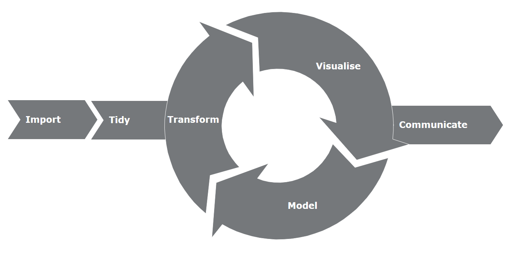

## Introduction
- Day 1 - Getting started
- Day 2 - Functions & Spark
- Day 3 - Tidyverse
- Day 4 - Plotly
- Day 5 - Shiny Introduction
- Day 6 - Reactivity
- Day 7 - Modules
- Day 8 - Shiny Project


# Day 2 - Functions & Spark
## Day 2 - Agenda
- Functions
- Spark

# Functions
## Functions
Example 1 - Hello World

```{r}
myFunction<-function(){
  print("Hello World")
}
myFunction()
```

## Functions
Example 2 - with inputs

```{r}
myFunction<-function(a,b=2){
  total<-a+b
  return(total)
}

myFunction(1,1)
myFunction(1)

```

## Functions
Example 3 - using titanic data and glm function to fit a logistic regression
```{r,eval=FALSE}
install.packages("titanic")
library(titanic)

fit<-glm( 
  data = titanic_train,
  formula = Survived ~ Sex + Age + Pclass,
  family = "binomial"
)
```

## Functions

Example 4 - use 'rio' package to read and write data from files

```{r,eval=FALSE}
install.packages("rio")
data<-rio::import(file = "Data/titanic_train.csv",setclass = "tbl",integer64="double")
rio::export(x = titanic_train,file = "Data/titanic_train.csv")
```

# Spark & db

## Data Science Toolchain 
<center>
```{r, out.width="90%", echo=FALSE}

```
</center>

## Spark & db
When working with big data use Spark
Spark is much faster than working with just R and can handle data that is of very very large size
Note that not all R functions work in Spark
```{r,eval=FALSE}
install.packages("sparklyr")
library(sparklyr)

spark_home_set("Spark/spark-2.2.1-bin-hadoop2.7")
sc<-spark_connect(master="local") # Create a connection to spark

```

## Import
```{r,eval=FALSE}
data<-spark_read_csv(
  sc,
  "titanic",
  "Data/titanic_train.csv",
  memory = FALSE,
  overwrite = TRUE
)

#import from R
import_iris<-copy_to(sc,iris,"spark_iris",overwrite=TRUE)
```


## Exercise 1

1. Write a function (*sim.pi*) that takes one argument (*iterations*) with a default value of 1000  
2. Generate two vectors (*x*,*y*) of length *iterations* which uniformly distributed between (-1,1)  
3. Test whether if each of the cordinates fall inside the unit circle  
<strong class="yellow2">HINT:</strong> `ifelse( x^2 + y^2 <=1, TRUE, FALSE)`  
4. Count how many of the cordinates fell inside the unit circle (*in*)  
5. return `4*in/iterations` 
6. Congradulations you estimated $\pi$!


