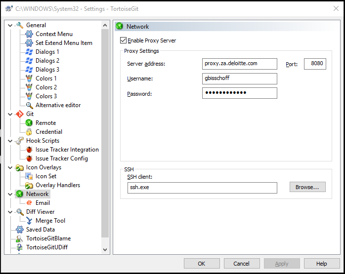
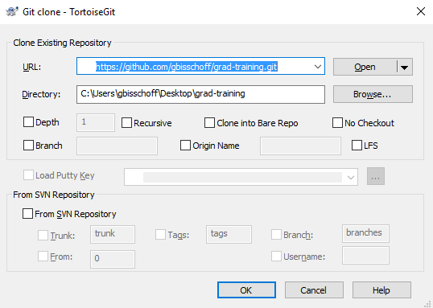

## Introduction
- Day 1 - Getting started
- Day 2 - Let's code
- Day 3 - Tidyverse
- Day 4 - Plotly
- Day 5 - Shiny Introduction
- Day 6 - Reactivity
- Day 7 - Modules
- Day 8 - Shiny Project

# Day 1 - Getting started
## Day 1 - Agenda
- Installing R
- Installing Packages
- Finding Help


## Installing R & Rstudio

>- Go to your internet browser and download [R](https://cran.r-project.org/bin/windows/base/R-3.4.3-win.exe)
>- Also, download [RStudio](https://download1.rstudio.org/RStudio-1.1.383.exe)
>- Run the R exe and wait for it to finish installing
>- Once done, go ahead and install RStudio

## Installing Git & Tortise Git
>- Go to your internet browser and download [Git](https://github.com/git-for-windows/git/releases/download/v2.15.1.windows.2/Git-2.15.1.2-64-bit.exe)
>- Also, download [TortoiseGit](https://download.tortoisegit.org/tgit/2.5.0.0/TortoiseGit-2.5.0.0-64bit.msi)
>- Install Git and then TortoiseGit

## Setup git proxy
<center>
```{r, out.width="60%", echo=FALSE}

```
</center>

## Clone git repo

<center>
```{r, out.width="60%", echo=FALSE}

```
</center>


## Installing Packages

>- To Install packages you can run `install.packages("package name")`
>- Lets try by installing the most important package we will be using later in the course; **tidyverse**
>- Tidyverse is a set of packages that makes data science easy
>- `install.packages("tidyverse")`
>- You can also use click ***Install*** button on the ***Packages*** tab, located on the bottom right

## Finding Help

>- To find help on a function or package that you have already installed, go to the ***Help*** tab on the bottom right and search for a package name or function in the search box
>- Alternatively, you can run `??function_name`. E.g. `??tidyverse`

##Rap up
>- Installing R
>- Installing Packages
>- Finding Help

# Day 2 - Let's code
## Day 2 - Agenda
- Functions
- Spark

## Functions
Example 1 - Hello World

```{r}
myFunction<-function(){
  print("Hello World")
}
myFunction()
```

## Functions
Example 2 - with inputs

```{r}
myFunction<-function(a,b=2){
  total<-a+b
  return(total)
}

myFunction(1,1)
myFunction(1)

```

## Functions
Example 3 - using titanic data and glm function to fit a logistic regression
```{r,eval=FALSE}
install.packages("titanic")
library(titanic)

fit<-glm( 
  data = titanic_train,
  formula = Survived ~ Sex + Age + Pclass,
  family = "binomial"
)
```

## Functions

Example 4 - use 'rio' package to read and write data from files

```{r,eval=FALSE}
install.packages("rio")
data<-rio::import(file = "Data/titanic_train.csv",setclass = "tbl",integer64="double")
rio::export(x = titanic_train,file = "Data/titanic_train.csv")
```

## Spark & db
When working with big data use Spark
Spark is much faster than working with just R and can handle data that is of very very large size
Note that not all R functions work in Spark
```{r,eval=FALSE}
install.packages("sparklyr")
library(sparklyr)

spark_home_set("Spark/spark-2.2.1-bin-hadoop2.7")
sc<-spark_connect(master="local") # Create a connection to spark

data<-spark_read_csv(
  sc,
  "titanic",
  "Data/titanic_train.csv",
  memory = FALSE,
  overwrite = TRUE
)

#import from R
import_iris<-copy_to(sc,iris,"spark_iris",overwrite=TRUE)
```

## Exercise 1

1. Write a function (*sim.pi*) that takes one argument (*iterations*) with a default value of 1000  
2. Generate two vectors (*x*,*y*) of length *iterations* which uniformly distributed between (-1,1)  
3. Test whether if each of the cordinates fall inside the unit circle  
<strong class="yellow2">HINT:</strong> `ifelse( x^2 + y^2 <=1, TRUE, FALSE)`  
4. Count how many of the cordinates fell inside the unit circle (*in*)  
5. return `4*in/iterations` 
6. Congradulations you estimated $\pi$!

<!-- ## Exercise 2 -->

<!-- 1. Open R and install the packages sparklyr.   -->
<!-- 2. Connect to Spark.  -->
<!-- 3. Import the iris data to Spark -->
<!-- 4. Partition the data into a training (50%) and test (50%) dataset. Use sdf_partition -->
<!-- 5. Use  -->

# Day 3 - Tidyverse
## Day 3 - Agenda

- select
- filter
- arrange
- mutate
- summarise
- group_by
- %>% (pipe)

```{r,  include=FALSE}
library(tidyverse)
```

## select

It’s not uncommon to get data sets with hundreds or even thousands of variables. In this case, the first challenge is often narrowing in on the variables you’re actually interested in. select() allows you to rapidly zoom in on a useful subset using operations based on the names of the variables.

```{r,eval=FALSE}

select(diamonds, cut, color, carat, price)
select(diamonds, x:z)
select(diamonds, -(x:z))
select(diamonds, starts_with("c"))
select(diamonds, ends_with("e"))
select(diamonds, contains("r"))

```
<strong class="blue2">TIP:</strong> Move sorting variables to the start of the data frame and only keep the important variables. Variables can be renamed at the same time.


## filter
filter() allows you to subset observations based on their values. The first argument is the name of the data frame. The second and subsequent arguments are the expressions that filter the data frame.

```{r,eval=FALSE}
filter(diamonds, cut=="Ideal")
filter(diamonds, cut!="Ideal")
filter(diamonds, carat>=4) # <, >, ==, !=, <=, >=
filter(diamonds, cut=="Ideal" & carat>=4 )
filter(diamonds, cut=="Ideal" | carat>=4 )
filter(diamonds, cut %in% c("Ideal","Premium"))

sqrt(2)^2 == 2
near(sqrt(2)^2, 2)
```

## arrange
arrange() works similarly to filter() except that instead of selecting rows, it changes their order. It takes a data frame and a set of column names (or more complicated expressions) to order by. If you provide more than one column name, each additional column will be used to break ties in the values of preceding columns.

```{r,eval=FALSE}
arrange(diamonds, cut) #A-Z
arrange(diamonds, desc(cut)) #Z-A

arrange(diamonds, price) #Small to large
arrange(diamonds, desc(cprice)) #Large to small

arrange(diamonds, cut, desc(price)) #by two or more variables
```

## mutate
Besides selecting sets of existing columns, it’s often useful to add new columns that are functions of existing columns. That’s the job of mutate().

>- <strong>Arithmetic:</strong> +, -, *, /, ^
>- <strong>Modular:</strong> %/% (integer division), %%  (remainder), x == y * (x %/% y) + (x %% y)
>- <strong>Logs:</strong> log(), log2(), logn()
>- <strong>Offsets:</strong> lead(), lag()
>- <strong>Cumulatives:</strong> cumsum(), cumprod(), cummin(), cummax() See RcppRoll package for more.
>- <strong>Logical:</strong> <, <=, >, >=, !=, ==
>- <strong>Ranking:</strong> min_rank(), row_number(), dense_rank(), percent_rank(),  cume_dist(), ntile()
>- <strong>User defined:</strong> function(){} – should be a vectorised function

## mutate
<strong class="blue2">TIP:</strong> Arithmetic operators are useful in conjunction with aggregate functions, e.g. X/sum(X) gives the proportion, and Y-mean(Y) computes the difference from the mean.  
<strong class="blue2">TIP:</strong> Offsets allows you to compute running differences (e.g. x-lag(x)) or find when values change (X != lag(X)) They are most useful in conjunction with group_by(), but make sure to sort first using arrange().


```{r,eval=FALSE}
mutate(
  diamonds,
  price_p_carat = price / carat,
  diff = price_p_carat - mean(price_p_carat),
  z_score = diff / sd(price_p_carat)
)
```


## summarise
The last key verb is summarise(). It collapses a data frame to a single row. summarise() is not terribly useful unless we pair it with group_by().  

>- <strong class="blue2">TIP:</strong> There are many built in functions so don’t reinvent the wheel.  
>- <strong class="blue2">TIP:</strong> The result of a summary can be used directly in the next step to calculate other statistics.  
>- <strong class="red2">WARNING:</strong> Remember when calculating statistics that the result is not always as you would expect, e.g. mean() returns the straight average not the weighted average. 
>- <strong class="red2">WARNING:</strong> Always check the documentation before using built in functions to know what options there are and what the default options are. It is important to understand exactly what you are calculating.

## summarise
```{r}
summarise(
  diamonds,
  N = n(),
  sum = sum(price),
  ave1 = sum / N,
  SSD = sum( (price - mean(price)) ^2),
  SD = sqrt( SSD / (n() -1) )
)
```

## group_by
summarise() is not terribly useful unless we pair it with group_by(). When you use the dplyr verbs on a grouped data frame they’ll be automatically applied “by group”.

<strong class="blue2">TIP:</strong> group_by() is useful when calculating statistics per group. These statistics can then be easily compared.  

<strong class="blue2">TIP:</strong> Complicated models can also be built and then run on a group-by-group basis.  

<strong class="red2">WARNING:</strong> When using group_by() with summarise() the groups get unwound after the summarise(). That means if you group by Var1 and Var2 after doing a summary the data frame will only be grouped by Var1. Thus the order of the variables used in the  group_by() matter.

## group_by
```{r}
diamonds_grouped <- group_by(diamonds,cut)
summarise(
  diamonds_grouped,
  N = n(),
  average = mean(price),
  SD = sd(price)
)
```

## %>% (pipe)
%>% is used to string functions together. This makes writing a set of logic clear and condensed.

```{r,  include=FALSE}
library(plotly)
pal_deloitte<-c("#86BC25", "#C4D600",  "#43B02A",	"#046A38", 	"#2C5234","#0097A9","#62B5E5","#00A3E0","#0076A8","#012169")
pal_deloitte2<-c("#DDEFE8",	"#9DD4CF", 	"#6FC2B4","#00ABAB","#0097A9","#007680","#004F59")
```
```{r,eval=FALSE}
diamonds%>%
  group_by(color, clarity)%>%
  summarise(n = n())%>%
  mutate(prop=n/sum(n))%>%
  plot_ly( x = ~color, y = ~prop, color= ~clarity,type = "bar",colors = pal_deloitte)%>%
  layout(barmode = "stack")
```

## %>% (pipe)
```{r echo=FALSE}
diamonds%>%
  group_by(color, clarity)%>%
  summarise(n = n())%>%
  mutate(prop=n/sum(n))%>%
  plot_ly( x = ~color, y = ~prop, color= ~clarity,type = "bar",colors = pal_deloitte)%>%
  layout(barmode = "stack")
```

## Exercise
Using the transition data calculate the transistion matrix for each segment. A transition rate is defined as:
$$p_{ij}=Pr({X_{t+1}=j|X_{t}=i})$$
$$p_{ij}=\frac{\sum_n balance_{n,t} \times I(X_{n,t+1}=j|X_{n,t}=i)}{\sum_n balance_{n,t} \times I(X_{n,t}=i)}$$
<strong class="yellow2">HINT:</strong> Make sure that your rows sum up to one  


# Day 4 - Plotly
## Day 4 - Agenda

- Scatter plots
- Line plots
- Bar charts
- Heatmaps
- Box plots
- Histograms
```{r,  include=FALSE}
library(plotly)
pal_deloitte<-c("#86BC25", "#C4D600",  "#43B02A",	"#046A38", 	"#2C5234","#0097A9","#62B5E5","#00A3E0","#0076A8","#012169")
pal_deloitte2<-c("#DDEFE8",	"#9DD4CF", 	"#6FC2B4","#00ABAB","#0097A9","#007680","#004F59")
```

## Scatter plots

```{r , eval=FALSE}
diamonds%>%
  dplyr::sample_n(1000)%>%
  plot_ly(colors = pal_deloitte)%>%
  add_markers(
    x = ~carat, 
    y = ~price, 
    color = ~color,
    size = ~carat, 
    text = ~paste("Clarity: ", clarity)
  )
```

## Scatter plots {.flexbox .vcenter}
```{r , echo=FALSE}
diamonds%>%
  dplyr::sample_n(1000)%>%
  plot_ly(colors = pal_deloitte)%>%
  add_markers(x = ~carat, y = ~price, color = ~color,
              size = ~carat, text = ~paste("Clarity: ", clarity))

```

## Line plots
```{r , eval=FALSE}
economics_long%>%
  plot_ly(
    x=~date,
    y=~value,
    color=~variable,
    colors = pal_deloitte,
    type="scatter",
    mode="lines"
  )
```

## Line plots {.flexbox .vcenter}
```{r , echo=FALSE}
economics_long%>%
  plot_ly(
    x=~date,
    y=~value,
    color=~variable,
    colors = pal_deloitte,
    type="scatter",
    mode="lines"
  )
```


## Bar charts 
```{r,eval=FALSE }
diamonds %>% 
  count(cut, clarity) %>%
  plot_ly(colors = pal_deloitte)%>%
  add_bars(
    x = ~cut, 
    y = ~n, 
    color = ~clarity
  )
```

## Bar charts {.flexbox .vcenter}
```{r,echo=FALSE }
diamonds %>% 
  count(cut, clarity) %>%
  plot_ly(colors = pal_deloitte)%>%
  add_bars(
    x = ~cut, 
    y = ~n, 
    color = ~clarity
  )
```


## Bar charts 
```{r , eval=FALSE}
diamonds%>%
  group_by(color,clarity)%>%
  summarise(n=n())%>%
  mutate(
    nn=sum(n),
    prop=n/nn
  )%>%
  plot_ly(x = ~color,colors = pal_deloitte)%>%
  add_bars(
    y = ~prop, 
    color = ~clarity
  ) %>%
  layout(barmode = "stack")

```

## Bar charts {.flexbox .vcenter}
```{r , echo=FALSE}
diamonds%>%
  group_by(color,clarity)%>%
  summarise(n=n())%>%
  mutate(
    nn=sum(n),
    prop=n/nn
  )%>%
  plot_ly(x = ~color,colors = pal_deloitte)%>%
  add_bars(
    y = ~prop, 
    color = ~clarity
  ) %>%
  layout(barmode = "stack")

```


## Heatmaps
```{r , eval=FALSE}
diamonds%>%
  group_by(cut, clarity) %>%
  summarise(N=n())%>%
  plot_ly() %>%
  add_heatmap( 
    x = ~cut, 
    y = ~clarity, 
    z =~N
  )

```
## Heatmaps {.flexbox .vcenter}
```{r , echo=FALSE}
diamonds%>%
  group_by(cut, clarity) %>%
  summarise(N=n())%>%
  plot_ly() %>%
  add_heatmap( 
    x = ~cut, 
    y = ~clarity, 
    z =~N
  )

```


## Box plots

```{r , eval=FALSE}
diamonds%>%
  plot_ly(colors = pal_deloitte)%>%
  add_boxplot(
    x = ~cut, 
    y = ~price, 
    color = ~clarity
  ) %>%
  layout(boxmode = "group")

```

## Box plots {.flexbox .vcenter}
```{r, message=FALSE, warning=FALSE, echo=FALSE}
diamonds%>%
  plot_ly(colors = pal_deloitte , type="box")%>%
  add_boxplot(
    x = ~cut, 
    y = ~price, 
    color = ~clarity
  ) %>%
  layout(boxmode = "group")

```


## Histograms
```{r , eval=FALSE}
plot_ly(alpha = 0.6,colors = pal_deloitte) %>%
  add_histogram(x = ~rnorm(500)) %>%
  add_histogram(x = ~rnorm(500) + 1) %>%
  layout(barmode = "overlay")
```
## Histograms {.flexbox .vcenter}
```{r , echo=FALSE}
plot_ly(alpha = 0.6,colors = pal_deloitte) %>%
  add_histogram(x = ~rnorm(500)) %>%
  add_histogram(x = ~rnorm(500) + 1) %>%
  layout(barmode = "overlay")
```


## Histograms
```{r , eval=FALSE}
plot_ly(alpha = 0.6,colors = pal_deloitte) %>%
  add_histogram(x = ~rnorm(500)) %>%
  add_histogram(x = ~rnorm(500) + 1) %>%
  layout(barmode = "stack")
```
## Histograms {.flexbox .vcenter}
```{r , echo=FALSE}
plot_ly(alpha = 0.6,colors = pal_deloitte) %>%
  add_histogram(x = ~rnorm(500)) %>%
  add_histogram(x = ~rnorm(500) + 1) %>%
  layout(barmode = "stack")
```

## Histograms
```{r , eval=FALSE}
diamonds%>%
  plot_ly(colors = pal_deloitte2)%>%
  add_histogram2d(x = ~carat, y = ~price)
```

## Histograms {.flexbox .vcenter}
```{r , echo=FALSE}
diamonds%>%
  plot_ly(colors = pal_deloitte2)%>%
  add_histogram2d(x = ~carat, y = ~price)
```

## Histograms
```{r , eval=FALSE}
diamonds%>%
  plot_ly(colors = pal_deloitte2)%>%
  add_histogram2dcontour(x = ~carat, y = ~price)
```
## Histograms {.flexbox .vcenter}
```{r , echo=FALSE}
diamonds%>%
  plot_ly(colors = pal_deloitte2)%>%
  add_histogram2dcontour(x = ~carat, y = ~price)
```


