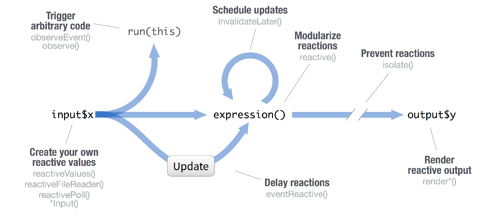

## Introduction
- Day 1 - Shiny Introduction
- Day 2 - Reactivity
- Day 3 - Modules
- Day 4 - Shiny Project


# Day 1 - Shiny Introduction
## Day 1 - Agenda

- Introduction
- Reactivity
- Shiny Dashboard


## Introduction

Now that we know how to build reports in R the next step is to communicate these results to other team members and or executives. For this you have a couple of options. Most of you will be familiar with a *word* document. The challenge with a word document is that each time you update a graph and/or table you have to copy this table into the word document and re-do the styling of it so that it looks similar to other graphs/tables. 

>- *Rmarkdown* is a type of document that you can create in R that automatically updates the graphs and tables (and can then be converted to a word document). Actually all my slides are made for *Rmarkdown*.  
>- If you want more user interaction like changing parameters, filtering the input data, changing the segmentation, then it is time to move to something a bit more interactive. This is where *Shiny* comes in. *Shiny* allows you to create web applications that allow you to get some input from a user and use that input to update graphs and tables. (At which point you could allow the user to download the *Rmarkdown* version of the graphs and tables)

## Main components

- `library(shiny)`
- `ui <- ...`
- `server <- function(input,output,session){}`
- `shinyApp(ui = ui, server = server)`

``` {r,eval=FALSE}
library(shiny)
ui <- fluidPage(
 numericInput(inputId = "n", "Sample size", value = 25),
 plotOutput(outputId = "hist")
)
server <- function(input, output, session) { 
  
 output$hist <- renderPlot({
  hist(rnorm(input$n))
 })
 
}
shinyApp(ui = ui, server = server)
```

## Reactivity 

Reactive values work together with reactive functions. Call a reactive value  from within the arguments of one of these functions to avoid the error *Operation not allowed without an active reactive context.*
 
<center>
```{r, out.width="85%", echo=FALSE}

```
</center>


## Shiny Dashboard

`shinydashboard` is a package that could be used to create ellegant dashboards with little effort.

# Day 2 - Modules
## Day 2 - Agenda

- Re-cap
- Modules

# Day 3 - Shiny Project
## Day 3 - Agenda

- App Design
- Twitter API

